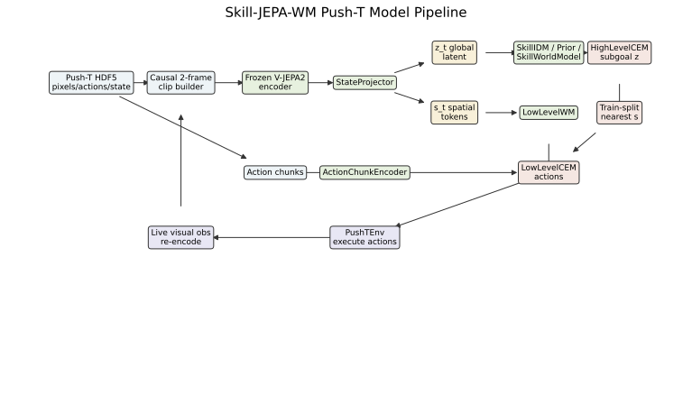
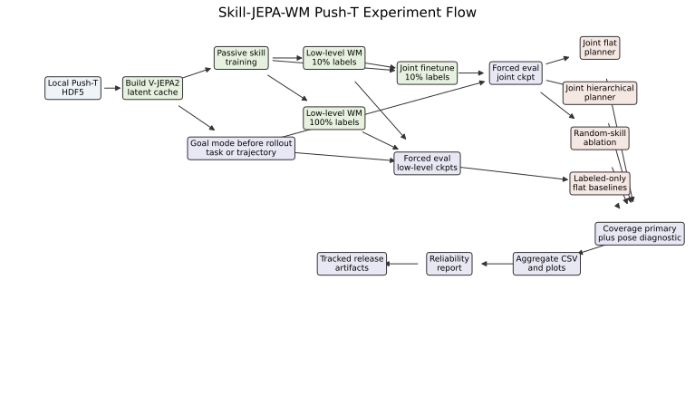

# Skill-JEPA-WM Push-T

Skill-JEPA-WM is a hierarchical world-model experiment built on top of `facebookresearch/jepa-wms`. This repository packages the Push-T branch of the work: frozen V-JEPA2 feature caching, passive latent skill learning, low-level action grounding, hierarchical planning, coverage-first online evaluation, and reliability artifacts for the debugging snapshot.

## Highlights

- Frozen `facebook/vjepa2-vitl-fpc64-256` encoder with offline HDF5 feature caching
- Continuous latent skill model trained from mostly action-free chunks
- Low-level action-conditioned JEPA world model trained on the labeled subset
- Hierarchical planner, flat planner, and random-skill hierarchical baseline
- Coverage-first Push-T online evaluation with deterministic NumPy/Torch/CUDA/env reseeding
- Strict checkpoint loading and train-split-only subgoal lookup for hierarchical eval
- Rendered model-pipeline and experiment-flow diagrams under `docs/architecture/`
- Reliability report, re-scored legacy artifacts, evaluation CSVs, JSON summaries, and rollout GIFs

## Visual Summary

Model pipeline:



Experiment flow:



Hierarchical rollout:


Flat rollout:


## Repository Scope

This is a focused experimental snapshot, not a full mirror of the upstream JEPA-WMs repository. It keeps the code paths needed for the Skill-JEPA-WM Push-T experiments plus a small set of result artifacts. Large datasets, cached features, checkpoints, and training logs are intentionally excluded.

## Installation

Python `3.10` or `3.11` is the target version.
The end-to-end cache, training, evaluation, and report-refresh commands assume a source checkout. Wheel builds are import/install checks for the `skill_jepa` Python package only. They are not standalone experiment bundles because source-tree scripts, configs, raw HDF5 files, generated caches, checkpoints, and large logs are intentionally excluded from the installed wheel.

```bash
git clone https://github.com/YichengDraw/skill-jepa-wm-pusht.git
cd skill-jepa-wm-pusht
python -m venv .venv
.venv\Scripts\activate
pip install -e .
```

If you prefer a lighter install for this Push-T line only:

```bash
pip install -r requirements.txt
pip install -e .
```

Dependency ranges are bounded to reduce simulator/numeric drift. Exact result replay also requires the artifact hashes recorded in each evaluation JSON.

## Data Preparation

The repository expects local Push-T HDF5 files and does not version them.

Recommended layout:

```text
data/
  pusht_expert_train.h5
  pusht_expert_train.h5.debug.bak
```

The committed debug configs assume:

- `data/pusht_expert_train.h5.debug.bak` for the small debug run
- `data/pusht_expert_train.h5` for the scaled locked suite

If your full file lives elsewhere, set:

```powershell
$env:PUSHT_FULL_RAW_H5="<path-to-pusht_expert_train.h5>"
```

## Main Files

- `src/skill_jepa/`: experiment modules, planners, trainers, and analysis
- `tools/cache_vjepa_features.py`: frozen V-JEPA2 cache builder
- `tools/run_skill_jepa_pusht_locked_suite.py`: locked-suite orchestration script
- `configs/exp/pusht_debug.yaml`: final debug protocol
- `configs/exp/pusht_debug_k2.yaml`: `K=2` ablation
- `configs/ablations/`: no-composition, no-effect-alignment, and no-hierarchy overrides
- `artifacts/`: selected reports and evaluation outputs tracked in git

## Usage

### 1. Build the debug cache

```bash
python -m tools.cache_vjepa_features --config configs/exp/pusht_debug.yaml
```

### 2. Train the three-stage debug pipeline

```bash
python -m skill_jepa.trainers.train_skill_passive --config configs/exp/pusht_debug.yaml
python -m skill_jepa.trainers.train_low_level --config configs/exp/pusht_debug.yaml
python -m skill_jepa.trainers.train_joint --config configs/exp/pusht_debug.yaml
```

### 3. Run online evaluation

```bash
python -m skill_jepa.analysis.eval_pusht_online ^
  --config configs/exp/pusht_debug.yaml ^
  --checkpoint outputs/skill_jepa/pusht_debug/joint/joint_best.pt ^
  --output outputs/skill_jepa/pusht_debug/planner_online_joint ^
  --mode both ^
  --goal-mode trajectory
```

`--goal-mode task` is the default for standard Push-T evaluation. It requires train-split cache states that already reach the Push-T coverage threshold, then uses those states as task-aligned goal latents. The bundled debug cache does not contain such high-coverage goal states, so its reruns must stay in explicit `trajectory` diagnostic mode.

### 4. Run the locked suite helper

This helper expects an existing debug checkpoint and projector under `outputs/skill_jepa/pusht_debug/`.

```bash
python -m tools.run_skill_jepa_pusht_locked_suite
```

## Architecture Notes

The rendered architecture sources are:

- `docs/architecture/model_pipeline.mmd`
- `docs/architecture/model_pipeline.svg`
- `docs/architecture/experiment_flow.mmd`
- `docs/architecture/experiment_flow.svg`

The key runtime path is: raw Push-T HDF5 frames/actions/states -> causal two-frame V-JEPA2 cache -> `z_t` global latent and `s_t` spatial tokens -> skill-level and low-level world models -> CEM planning -> PushTEnv online control with live visual re-encoding.

## Reported Results

### Historical debug status

- Historical diagnostic setting: `K=4`, `goal_gap=24`, `max_episode_steps=32`, `execute_actions_per_plan=4`
- The old sampled-goal numbers are archived as trajectory diagnostics.
- They are excluded from the public headline path for Push-T task success.

These debug numbers are historical goal-state-reaching diagnostics. They are not standard Push-T coverage-success evidence.

### Trajectory-goal reliability re-score

From `artifacts/release/skill_jepa_wm_reliability_report.md`:

| Method | Coverage success | Goal-state diagnostic | Unique episodes | Mean sampled-state distance | Mean planning latency |
|---|---:|---:|---:|---:|---:|
| Hierarchical | 0.00 | 0.07 | 1 | 264.43 | 0.249 s |
| Flat | 0.00 | 0.07 | 1 | 355.30 | 0.564 s |

Interpretation:

- Legacy pre-rescore outputs used `success_rate` for sampled-trajectory goal-state success; current tracked eval exports use coverage-specific names.
- The legacy locked artifact has repeated sampled pairs from one unique episode.
- Hierarchy improves sampled-state distance and planning latency in that artifact.
- The artifact uses trajectory-goal planning targets. It does not support a standard Push-T task-success claim.

### Phase A external-debug checkpoint eval

The corrected evaluator was rerun against the available external debug cache/checkpoint with replacement disabled, explicit under-sampling, train-split subgoal lookup, env seeding, portable paths, and artifact hashes. The old external cache/checkpoint do not record cache/projector lineage hashes, so the artifact records provenance warnings. The debug cache yields one unique test episode and no train-split states above the task coverage threshold, so this is an explicit trajectory-goal smoke rerun rather than a scaled Push-T task verdict.

| Method | Coverage diagnostic | Goal-state diagnostic | Mean sampled-state distance | Mean planning latency |
|---|---:|---:|---:|---:|
| Hierarchical | 0.00 | 0.00 | 464.56 | 0.129 s |
| Flat | 0.00 | 0.00 | 321.15 | 0.305 s |

## Tracked Artifacts

- `artifacts/release/skill_jepa_wm_reliability_report.pdf`
- `artifacts/release/plots/`
- `artifacts/release/sanitized_locked_artifacts/`
- `artifacts/phase_a_current_checkpoint/evals/`
- `artifacts/pusht_locked_suite/evals/current_best_checkpoint_100ep/pusht_online_eval.json`
- `artifacts/pusht_locked_suite/evals/current_best_checkpoint_100ep/pusht_online_records.csv`

## Limitations

- Checkpoints, raw HDF5 files, and cached latents are not committed because they are too large for a normal GitHub repository.
- The tracked legacy locked artifact is useful for regression and reporting hygiene, but it is not a full held-out Push-T task-success evaluation.
- The 3-seed scaled locked suite is not complete in the tracked artifacts.
- The feasibility critic is intentionally absent because the hierarchy line has not yet cleared the locked scaling gate.

## Base Code and Attribution

This repository packages experiment work built on top of `facebookresearch/jepa-wms`. The original upstream repository and its licenses remain the foundation for the included code.

## License

CC BY-NC 4.0 for this repository snapshot, with upstream third-party notices retained in `THIRD-PARTY-LICENSES.md`.
