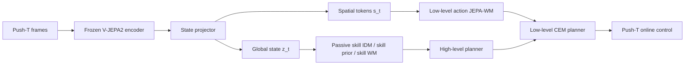

# Skill-JEPA-WM Push-T

Skill-JEPA-WM is a hierarchical world-model experiment built on top of `facebookresearch/jepa-wms`. This repository packages the Push-T branch of the work: frozen V-JEPA2 feature caching, passive latent skill learning, low-level action grounding, hierarchical planning, locked online evaluation, and the reports produced during the debugging phase.

## Highlights

- Frozen `facebook/vjepa2-vitl-fpc64-256` encoder with offline HDF5 feature caching
- Continuous latent skill model trained from mostly action-free chunks
- Low-level action-conditioned JEPA world model trained on the labeled subset
- Hierarchical planner, flat planner, and random-skill hierarchical baseline
- Cache-consistent Push-T online evaluation with deterministic per-episode reseeding
- Included debug and locked-progress reports, evaluation CSVs, JSON summaries, and rollout GIFs

## Visual Summary

Hierarchical rollout:


Flat rollout:


## Repository Scope

This is a focused experimental snapshot, not a full mirror of the upstream JEPA-WMs repository. It keeps the code paths needed for the Skill-JEPA-WM Push-T experiments plus a small set of result artifacts. Large datasets, cached features, checkpoints, and training logs are intentionally excluded.

## Installation

Python `3.10` is the target version.

```bash
git clone https://github.com/YichengDraw/skill-jepa-wm-pusht.git
cd skill-jepa-wm-pusht
python -m venv .venv
.venv\Scripts\activate
pip install -e .
```

If you prefer a lighter install for this Push-T line only:

```bash
pip install -r requirements.txt
pip install -e .
```

## Data Preparation

The repository expects local Push-T HDF5 files and does not version them.

Recommended layout:

```text
data/
  pusht_expert_train.h5
  pusht_expert_train.h5.debug.bak
```

The committed debug configs assume:

- `data/pusht_expert_train.h5.debug.bak` for the small debug run
- `data/pusht_expert_train.h5` for the scaled locked suite

If your full file lives elsewhere, set:

```powershell
$env:PUSHT_FULL_RAW_H5="D:\path\to\pusht_expert_train.h5"
```

## Main Files

- `src/skill_jepa/`: experiment modules, planners, trainers, and analysis
- `tools/cache_vjepa_features.py`: frozen V-JEPA2 cache builder
- `tools/run_skill_jepa_pusht_locked_suite.py`: locked-suite orchestration script
- `configs/exp/pusht_debug.yaml`: final debug protocol
- `configs/exp/pusht_debug_k2.yaml`: `K=2` ablation
- `configs/ablations/`: no-composition, no-effect-alignment, and no-hierarchy overrides
- `artifacts/`: selected reports and evaluation outputs tracked in git

## Usage

### 1. Build the debug cache

```bash
python -m tools.cache_vjepa_features --config configs/exp/pusht_debug.yaml
```

### 2. Train the three-stage debug pipeline

```bash
python -m skill_jepa.trainers.train_skill_passive --config configs/exp/pusht_debug.yaml
python -m skill_jepa.trainers.train_low_level --config configs/exp/pusht_debug.yaml
python -m skill_jepa.trainers.train_joint --config configs/exp/pusht_debug.yaml
```

### 3. Run online evaluation

```bash
python -m skill_jepa.analysis.eval_pusht_online ^
  --config configs/exp/pusht_debug.yaml ^
  --checkpoint outputs/skill_jepa/pusht_debug/joint/joint_best.pt ^
  --output outputs/skill_jepa/pusht_debug/planner_online_joint ^
  --mode both
```

### 4. Run the locked suite helper

This helper expects an existing debug checkpoint and projector under `outputs/skill_jepa/pusht_debug/`.

```bash
python -m tools.run_skill_jepa_pusht_locked_suite
```

## Architecture Notes



## Reported Results

### Debug status

From `artifacts/pusht_debug/EXPERIMENT_STATUS.md`:

- Best debug setting: `K=4`, `goal_gap=24`, `max_episode_steps=32`, `execute_actions_per_plan=4`
- Debug hierarchical success: `0.25`
- Debug flat success: `0.00`
- Debug labeled-only flat baseline success: `0.00`

### Locked 100-episode reevaluation

From `artifacts/pusht_locked_suite/reports/current_best_checkpoint_comparison.csv`:

| Method | Success | Mean pose distance | Mean planning latency |
|---|---:|---:|---:|
| Hierarchical | 0.07 | 264.43 | 0.249 s |
| Flat | 0.07 | 355.30 | 0.564 s |

Interpretation:

- Hierarchy keeps a clear pose-distance advantage.
- Hierarchy keeps a large planning-latency advantage.
- The 100-episode locked reevaluation does not show a success-rate advantage over flat.

## Tracked Artifacts

- `artifacts/pusht_debug/skill_jepa_wm_report.pdf`
- `artifacts/pusht_locked_suite/skill_jepa_wm_locked_progress_report.pdf`
- `artifacts/pusht_locked_suite/evals/current_best_checkpoint_100ep/pusht_online_eval.json`
- `artifacts/pusht_locked_suite/evals/current_best_checkpoint_100ep/pusht_online_records.csv`

## Limitations

- Checkpoints and cached latents are not committed because they are too large for a normal GitHub repository.
- The 3-seed scaled locked suite is not complete in the tracked artifacts.
- The feasibility critic is intentionally absent because the hierarchy line has not yet cleared the locked scaling gate.

## Base Code and Attribution

This repository packages experiment work built on top of `facebookresearch/jepa-wms`. The original upstream repository and its licenses remain the foundation for the included code.

## License

MIT for this repository snapshot, with upstream third-party notices retained in `THIRD-PARTY-LICENSES.md`.
